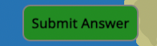
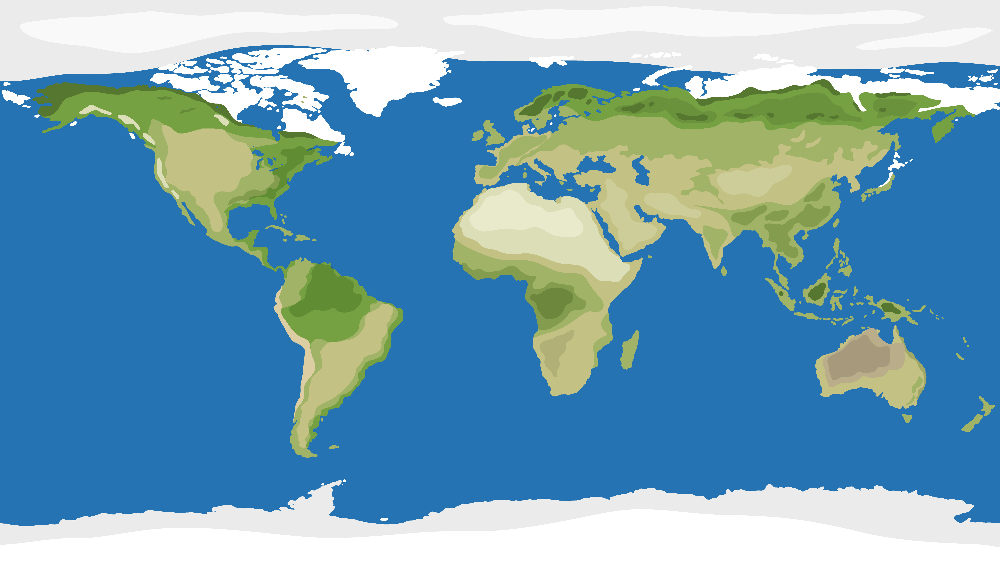

# Geo Quiz

Geo Quiz is an interactive geography quiz. Geo quiz tests the user's knowledge of capital cities, languages and populations of numerous countries. On clicking the 'start' button, a country is randomly generated and the user must asnwer with the country's capital city, language(s) and select the correct population. Ultimately, I would like to expand the list of countries included and enhance the interactivity of the site.

## Game Logic
- Countires array lists numerous objects. These objects have key-value pairs representing different attributes of the object;
  - 'name': name of the country,
  - 'capital': capital city of the country, 
  - 'language': array containing the language(s) spoken in the country, and
  - 'population': rounded population value.

- When the page is loaded, the question data is not yet displaying.

- When the user hits 'start';
  - an object is randomly selected from the countries array,
  - the 'name' of the object is displayed,
  - the 'population' value of the object is increased and reduced by 10% and all three values are displayed (these values are displayed randomly across three elements to ensure the user can't simply select the same button for correct population each time), and
  - the user's focus is brought to the input field for 'Capital City'.

- The user then enters answers in the input fields for 'Capital City' and 'Language' and clicks one of the population values.

- When the user hits 'submit';
  - the user receives an alert informing them if their answer was correct. If the answer is incorrect they receive the correct answer(s).
  - the count of correct or incorrect answers tally in the bottom of the screen, and
  - the game re-runs displaying another randomly selected country.

## Existing Features

### Interactive User Interface
- __Button Colours__ 
  - 'start', button changes colour on hover.  
        
  - 'population' buttons change colour on hover.     
       
  - 'submit' button changes colour on hover.      
       

- __Mouse Clicks & Keyboard Input__
  - 'start', 'submit' and population buttons are all responsive to mouse clicks;
      -'start' runs game and focuses cursor to input field,
      -'population' provides user's answer to checkAnswer function,
      -'submit' shows alter, tallies score, re-runs game and focuses cursor to input field.
  - 'submit' button is also responsive to 'Enter' keyboard input.
  
- __Initial Focus__
  - Initial focus is used to bring the user stright to the Capital City input field to enhance user experience.

- __Display Data__
  - Country name is displayed in response to user actions,
  - Country population, population +10% and population -10% is displayed randomly across three different spans in response to user actions. This ensures that the correct population value is not always displayed to the same element.

### Simple Layout and Background  
- __Background__
  - Simple background image was used which shows an aesthetically pleasing world map.
  
  - Simple display boxes and buttons use opacity to ensure adequate contrast while complementing the image.
  

### Answer Validation & User Alert
  - The code validates user-provided answers by comparing them with the correct answers stored in the countries array.
  - It provides feedback to users, indicating whether their answers are correct or incorrect.

  - All answers must be complete by the user to all for submission.

### Score Tracking 
- The game tracks users' scores, incrementing counts for both correct and incorrect answers.
- The scores are displayed to users, allowing them to track their performance throughout the game session.

### Additional Features 
- __Time Sensitivity__

  - I would like to add an egg timer which would start to countdown on click of 'start' button.
  - I would like the user to select 'easy', 'medium' or 'hard' to determine the amount of time allotted.

- __Increase Countries Array__

  - I would like to increase the countries array to include more countries.

- __Select Continent to be tested__

  - Once the countries array is complete (includes all countries), I would like to add a 'continent' value to the countries array.
  - I would then like to change the HTML and Javascript to allow the user to select the continent to be tested.

- __Automatically updating data__

  - I would like to figure out how I could add more values to the countries array and have them update automatically. This would be really cool to keep the population data up to date with the most recent census but also include things like 'current president' etc.
  
## Testing

### Testing Table

| Action    | Expectation | Result | 
| ---------|:-------------------:|----------|
| Enter URL | Arrive at Home | Pass |
| Click Start | Generate Country Name & Population Values | Pass |
| Click Submit (answers incomplete) | Display Appropirate Alert | Pass |
| Click Submit (all answers correct) | Display Appropirate Alert, Increment Score, Generate Country Name & Population values | Pass |
| Click Submit (all answers incorrect) | Display Appropirate Alert, Increment Score, Generate Country Name & Population values | Pass |
| Click Submit (mix incorrect & correct answers) | Display Appropirate Alert, Increment Score, Generate Country Name & Population values | Pass |
| Hover Mouse on Start | Change Colour | Pass |
| Hover Mouse on Submit | Change Colour | Pass |
| Hover Mouse on Population Vlaues | Change Colour | Pass |
| Screen Responsivity | Change Styling Appropriately | Pass |

### Validator Testing
- __HTML__
  - No errors returend through W3C validator.

- __CSS__
  - No errors returned through jigsaw validator.

- __Javascript__
  - No errors returned through jshint validator.

### Unfixed Bugs / Issues
- __Population value Spans__
  - When the page is first loaded, the spans which hold the population values display empty. This is a little bit unsightly and I didn't have time to figure out how to only have these elements displayed once the 'start' button is selected.

## Deployment

- The site was deployed to GitHub pages. The steps to deploy are as follows:
  - In the GitHub repository, navigate to the Settings tab
  - From the source section drop-down menu, select the Master Branch
  - Once the master branch has been selected, the page will be automatically refreshed with a detailed ribbon display to indicate the successful deployment.

- The live link can be found here: <https://seanfreaney.github.io/geo-quiz/>

## Credits

### Javascript logic
- __Love Maths__
  - Code to start running game after the DOM has loaded - referenced in comment,
  - Cursor focus to 'box1' input field,
  - Listen for 'keypress' event on the document,
  - runGame function logic,
  - adaptation of the checkAnswer function logic. (My checkAnswer function grew to become a little too complex),
  - Use of isCorrect logic in checkAnswer function,
  - Clearing of user inputs on submit in checkAnswer function,
  - Increment correct and incorrect scores.

- __find()__
  - this logic was used in the correctAnswer and checkAnswer functions.
  - W3 Schools - <https://www.w3schools.com/jsref/jsref_find.asp>

- __Arrow Functions__
  - this logic was used in the correctAnswer and checkAnswer functions.
  - Bro Code Arrow Functions javascript tutorial - <https://www.youtube.com/watch?v=fRRRkognpOs>

- __join()__
  - this logic was used in displaying the user an alert related to their language answer to show and combine the languages array from the language key.
  - EDUCBA - <https://www.educba.com/javascript-join/>

- __Array Destructuring__
  - used in the checkAnswer function.
  - MDN web docs - <https://developer.mozilla.org/en-US/docs/Web/JavaScript/Reference/Operators/Destructuring_assignment>

- __toFixed()__
  - used in the displayCoutry function.
  - Base Dash - <https://www.basedash.com/blog/overview-the-javascript-number-tofixed-method>

- __Fisher-Yates shuffle__
  - used in the shuffle function and displayCountry function.
  - Free Code Camp - <https://www.freecodecamp.org/news/how-to-shuffle-an-array-of-items-using-javascript-or-typescript/>

- __querySelector()__
  - used in Domcontent loaded and checkAnswer functions.
  - MDN web docs - <https://developer.mozilla.org/en-US/docs/Web/API/Document/querySelector>

- __nextElementSibling__
  - used in checkAnswer function.
  - Geeks for geeks - <https://www.geeksforgeeks.org/html-dom-nextelementsibling-property/>

- __parseFloat__
  - used in checkAnswer function.
  - Flexiple - <https://flexiple.com/javascript/parsefloat-javascript>

- __Ternary operators__
  - used in message alert in checkAnswer function.
  - Beau teaches Javascript <https://www.youtube.com/watch?v=s4sB1hm73tw>

### Icons8
- __Icon__
  - Icon from Icons8.

### Media
- __Population data__
  - Populations (Note here on intent to update) - https://www.worldometers.info/population/countries-in-europe-by-population/
- __Images__
  - __Freepik.com__
  - Background image.
 